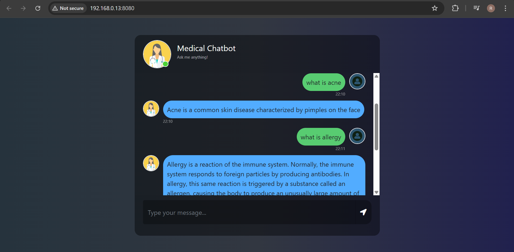
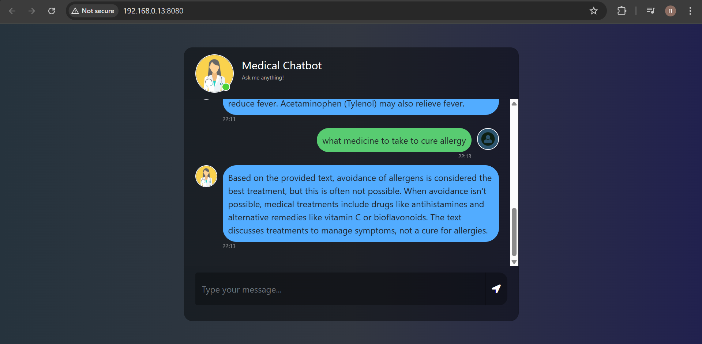

# 🏥 Medical RAG Chatbot using Gemini, LangChain, and Pinecone

A medical domain-specific chatbot built using **LangChain**, **Gemini API**, **Pinecone**, and **Flask**. It leverages **RAG (Retrieval-Augmented Generation)** with data extracted from *The GALE Encyclopedia of Medicine* to provide informed responses related to health and medical queries.

---

## 📑 Table of Contents

- [Overview](#-overview)
- [Tech Stack](#-tech-stack)
- [How It Works](#how-it-works)
- [Setup Instructions](#-setup-instructions)
- [Directory Structure](#-directory-structure)
- [Challenges Faced](#challenges-faced)
- [Unique Features](#-unique-features)
- [Future Improvements](#-future-improvements)
- [Screenshots](#-screenshots)
- [License](#-license)

---

## 📖 Overview

This chatbot aims to assist users with basic medical knowledge queries by combining **retrieval-based search** with **generative AI**. It is different from general-purpose chatbots as it is trained only on medically relevant data from an authoritative source (*The GALE Encyclopedia of Medicine*).

---

## 🛠 Tech Stack

- **Frontend:** HTML, CSS (Flask Templates)
- **Backend:** Flask
- **LLM:** Gemini (via Google Generative AI API)
- **RAG:** LangChain Retrieval Chain
- **Vector Store:** Pinecone
- **Embeddings:** HuggingFace Sentence Transformers

---

## ⚙️ How It Works

> This project uses the **RAG (Retrieval-Augmented Generation)** architecture.

### 🧠 RAG Flow:
1. **User Input**: The user enters a health-related query.
2. **Retriever**: The question is embedded and compared to preprocessed chunks from the GALE book stored in Pinecone.
3. **Relevant Context**: Top 3 most similar chunks are retrieved.
4. **LLM Response**: The Gemini model receives both the query and retrieved context.
5. **Response**: A medically informed response is returned to the user.

```
[User Input] → [Retriever: Pinecone + LangChain] → [Gemini LLM] → [Answer]
```

---

## 🚀 Setup Instructions

### 1. Clone the repository
```bash
git clone https://github.com/your-username/medical-chatbot.git
cd Medical-Chatbot
```

### 2. Install dependencies
```bash
pip install -r requirements.txt
```

### 3. Create a `.env` file and add:
```
PINECONE_API_KEY=your_pinecone_key
GOOGLE_API_KEY=your_google_gemini_key
```

### 4. Run the application
```bash
python app.py
```

Visit `http://localhost:8080` in your browser.

---

## 📁 Directory Structure

```
medical-chatbot/
├── Data/                      # Raw data (GALE Encyclopedia PDF or text)
├── src/
│   ├── helper.py              # Embedding + Pinecone utils
│   ├── prompt.py              # Prompt template for Gemini
├── static/
│   └── style.css              # CSS styling
├── templates/
│   └── chat.html              # Web UI
├── app.py                     # Main Flask backend + RAG logic
├── store_index.py             # Builds and stores Pinecone index
├── requirements.txt
└── .env                       # API keys (ignored in .gitignore)
```

---

## ⚠️ Challenges Faced

- **Data Quality**: Limited to a single book, which may lack complete coverage.
- **API Rate Limits**: Gemini and Pinecone have free-tier restrictions.
- **Deployment Constraints**: Avoiding paid services made optimization challenging.

---

## ✨ Unique Features

- ✅ Built using free-tier tools only.
- 🩺 Strictly medical-focused unlike general chatbots.
- 📚 Powered by a well-known medical encyclopedia.
- 🌐 Simple and responsive web interface.

---

## 🔮 Future Improvements

- Expand knowledge base using multiple medical datasets.
- Add medical entity extraction and diagnosis capabilities.
- Deploy with persistent hosting and authentication.

---

## 📸 Screenshots

> UI built with HTML/CSS, screenshot stored in `SS/` folder.




---

## 📜 License

This project is licensed under the MIT License.

---

