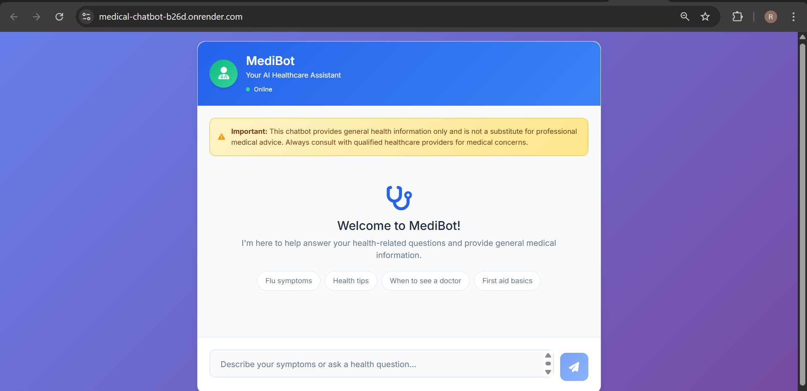
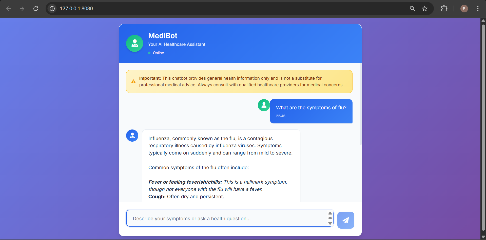

# 🏥 Medical RAG Chatbot using Gemini, LangChain, and Pinecone

A medical domain-specific chatbot built using **LangChain**, **Gemini API**, **Pinecone**, and **Flask**. It leverages **RAG (Retrieval-Augmented Generation)** with data extracted from *The GALE Encyclopedia of Medicine* to provide informed responses related to health and medical queries.

---



---

## 📑 Table of Contents

* [Overview](#-overview)
* [Tech Stack](#-tech-stack)
* [How It Works](#-how-it-works)
* [Setup Instructions](#-setup-instructions)
* [Directory Structure](#-directory-structure)
* [Challenges Faced](#-challenges-faced)
* [Unique Features](#-unique-features)
* [Future Improvements](#-future-improvements)
* [Screenshot](#-screenshot)
* [License](#-license)

---

## 📖 Overview

This chatbot answers user queries related to medical information using a custom **RAG pipeline** with context-aware prompt construction. It uses **Google Gemini** for generating responses, **Hugging Face embeddings** for semantic similarity, and **Pinecone** as the vector database. Queries are classified and routed for better accuracy, with dynamic fallback to real-time web search when needed.

---

## 🛠 Tech Stack

* **Backend:** Python, Flask
* **Frontend:** HTML, CSS (Flask Templates)
* **LLM:** Gemini via Google Generative AI API
* **RAG Framework:** LangChain
* **Vector Store:** Pinecone
* **Embeddings:** Hugging Face Sentence Transformers
* **Web Search:** DuckDuckGo Search Tool
* **Deployment:** Render

---

## ⚙️ How It Works

> Uses a custom-built RAG pipeline enhanced with query classification and fallback logic.

### 🧠 Flow:

1. **User Input**: The user submits a medical query.
2. **Query Classification**: Determines if it’s general, drug-related, emergency, or requires recent info.
3. **Retriever**: Top 3 most relevant medical chunks retrieved from Pinecone using embeddings.
4. **Web Search (if needed)**: Fallback to DuckDuckGo for current or drug-specific data.
5. **Prompt Construction**: Context from KB and web is formatted with role-specific prompts.
6. **LLM Response**: Gemini generates a final answer with disclaimers.
7. **Output**: A complete, safe medical response is sent back to the frontend.

```
[User Input] → [Query Classifier] → [Pinecone Retriever] → [Gemini + Prompt] → [Response with Disclaimer]
```

---

## 🚀 Setup Instructions

### 1. Clone the repository

```bash
git clone https://github.com/your-username/medical-chatbot.git
cd medical-chatbot
```

### 2. Install dependencies

```bash
pip install -r requirements.txt
```

### 3. Create a `.env` file and add:

```
PINECONE_API_KEY=your_pinecone_key
GOOGLE_API_KEY=your_gemini_key
```

### 4. Run the application

```bash
python app.py
```

Visit `http://localhost:8080` in your browser.

---

## 📁 Directory Structure

```
medical-chatbot/
├── src/
│   ├── helper.py              # Embedding setup and retriever init
│   └── prompt.py              # System prompts for each query type
├── templates/
│   └── chat.html              # UI (copied template)
├── static/                    # Optional styling
├── app.py                     # Flask backend with RAG logic
├── requirements.txt
├── .env                       # Environment variables (API keys)
└── SS/
    └── 1.png, 2.png           # Screenshots
```

---

## ⚠️ Challenges Faced

* Handling cases with limited information in vector DB
* Preventing inaccurate LLM hallucinations for medical queries
* Query routing to correct information source (KB or Web)
* Dealing with LLM API rate limits and context token limits

---

## ✨ Unique Features

* Custom query classifier for accurate routing
* Hybrid data use: vector DB + real-time web search
* Contextual prompt engineering with disclaimers
* Backend-first design with clear modular separation
* Runs fully on free-tier services (Gemini + Pinecone + Render)

---

## 🔮 Future Improvements

* Add conversational memory to support multi-turn queries
* Expand to multiple books/datasets for broader coverage
* Add multilingual support for patient accessibility
* Implement admin UI for dataset updates and logs

---

## 📸 Screenshot



---

## 📜 License

This project is licensed under the MIT License.


